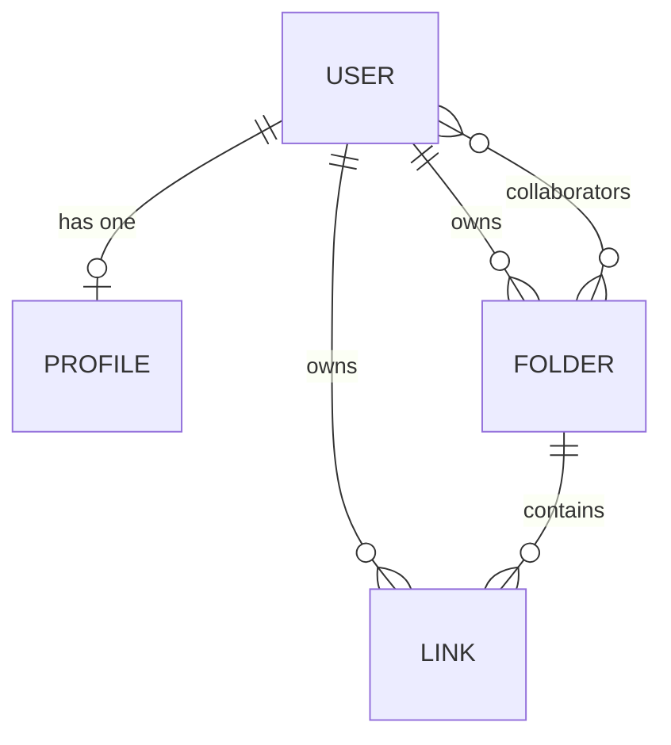

# ⚙️ LinkFlow API Server

LinkFlow API Server is a fast, robust, and real-time backend powered by **Express.js**, **Mongoose / MongoDB**, and **Socket.io**. It handles secure user accounts, automated link metadata scraping/categorization, collaborative multi-user shared collection rooms, and serves gorgeous, responsive **Server-Side Rendered (SSR) public bio profiles** directly to visitors.

---

## ✨ Features

- **🔐 Robust Auth & Migration Logic**: JWT-based session security. Upon the first administrator registration, the server automatically scans and migrates any orphaned or guest collections/links to prevent data loss.
- **📁 Collaborative Rooms**: Powered by Socket.io, users join dedicated real-time room splits (`folder_{id}`) to collaborate instantly inside shared collections.
- **🏷️ Automated URL Scraping Microservice**: A metadata parser using `axios` and `cheerio` that scrapes OpenGraph and Twitter cards (title, description, dynamic thumbnail) when a user pastes a URL, auto-categorizing it (*Video, Article, Product, Social, Other*).
- **🎨 SSR Public Bio Profiles (`/bio/:username`)**: Renders beautifully optimized, responsive bio links pages directly in vanilla HTML, featuring 4 HSL palette presets:
  - `purple-dark`: Space and ultraviolet premium dark mode.
  - `sunset`: Vibrant orange/red warmth.
  - `nordic-light`: Minimalist, clean grey/sky-blue light theme.
  - `glassmorphic`: Frosted, glossy glass panel interfaces with floating shadows.
- **🏗️ tsx Execution Layer**: Modern TypeScript runner using `tsx` for sub-second hot restarts and Zero-Compile development workflow.

---

## 🛠️ Tech Stack

- **Server Core**: Express.js (v5)
- **Runtime Compiler**: TypeScript with `tsx` (TypeScript Execute)
- **Database Wrapper**: Mongoose & MongoDB Atlas
- **WebSockets**: Socket.io for real-time events and bidirectional communications
- **Scraping Engine**: Axios & Cheerio (DOM crawler)
- **Security**: `bcryptjs` (password hashing) and `jsonwebtoken` (JWT secure tokens)

---

## 📂 Project Structure

```directory
server/
├── src/
│   ├── index.ts         # Main server initialization, websocket listener, and db connector
│   ├── middleware/      # Middleware guards
│   │   └── auth.ts      # authenticateToken header verification guard
│   ├── models/          # MongoDB Mongoose schemas
│   │   ├── User.ts      # User credentials and migration structures
│   │   ├── Folder.ts    # Folder structures, owners, and collaborator arrays
│   │   ├── Link.ts      # Link properties with parsed metadata schemas
│   │   └── Profile.ts   # Bio-profile settings (name, biography, theme type)
│   ├── routes/          # REST Endpoint handlers
│   │   ├── auth.ts      # Register, Login, and Auth Token validations
│   │   ├── folders.ts   # Collaborative collections CRUD & sockets triggers
│   │   ├── links.ts     # Links creation (including scraping logic) & manipulation
│   │   └── public.ts    # Profile settings & SSR public Bio render (/bio/:username)
│   └── services/        # Logic handlers
│       └── scraper.ts   # Cheerio OpenGraph crawler & domain-based categorization
├── .env                 # Local variables (ignored by Git)
├── tsconfig.json        # TypeScript compile directives
└── package.json         # Dependecies and scripts
```

---

## 🗄️ Database Schemas & Relationships



- **User**: Represents registered accounts. Keeps `username` (alphanumeric validation), `email`, and hashed passwords.
- **Folder**: Houses bookmarks. Holds `owner` reference, `isPublic` flag, and an array of `collaborators` (Users allowed to read/write links).
- **Link**: Individual bookmarks. Holds parent `folderId`, `url`, `title`, description, scraped `imageUrl`, and automatic `category` tag.
- **Profile**: Configuration for user's public URL bio page. Configures page `theme`, `bio`, `name`, and custom profile `avatarUrl`.

---

## 🚀 Getting Started & Local Setup

Follow these steps to run the server locally on your development machine:

### 📋 Prerequisites

Ensure you have **Node.js (version 18 or above)** and a **MongoDB** instance (local or a free cluster on MongoDB Atlas) running.

### 📦 Installation

1. Navigate to the server workspace directory:
   ```bash
   cd server
   ```
2. Install all node packages:
   ```bash
   npm install
   ```

### ⚙️ Environment Variables Configuration

Create a `.env` file in the root of the `server/` directory and populate it with your settings:

```env
PORT=3001
MONGO_URI=mongodb+srv://<username>:<password>@cluster.mongodb.net/linkflow
JWT_SECRET=your-secure-dev-jwt-secret-key-string
```

### 🏃 Running Locally

Start the server in hot-reload development mode (restarts automatically on file changes):
```bash
npm run dev
```

To run in production mode:
```bash
npm start
```

Your server will be running at `http://localhost:3001`. You can test it by visiting:
- Health check: `http://localhost:3001/`
- Render check: `http://localhost:3001/bio/<registered_username>`

---

## 🌐 Render.com Production Deployment Guide

LinkFlow Server is production-ready for deployment as a **Web Service** on **Render.com**. Follow this configuration checklist:

### 1. Create a New Web Service
- Connect your GitHub repository containing the `server` code to Render.
- Set the **Root Directory** of the service to `server` if deploying from a monorepo workspace.

### 2. General Settings
- **Environment**: `Node`
- **Build Command**: `npm install`
- **Start Command**: `npm start` *(This runs the command `tsx src/index.ts` to spin up the API immediately)*

### 3. Environment Variables Settings
Navigate to the **Environment** tab in your Render service dashboard and add the following keys:

| Key | Example / Description |
| :--- | :--- |
| `MONGO_URI` | `mongodb+srv://<user>:<pwd>@cluster.ojtfnzc.mongodb.net/` |
| `JWT_SECRET` | `your-high-entropy-production-secret-phrase` |
| `PORT` | `3000` *(Render will inject its own port, but you can override if desired)* |

### 4. WebSocket Support
Render Web Services support **Socket.io out of the box**! Since Socket.io is configured to allow CORS on the server (`origin: "*"`), the mobile application can connect directly to the main service URL.

- **Production API URL**: `https://linkflow-server-uask.onrender.com`

---

## 📡 REST API Reference

### User Authentication

* **`POST /api/auth/register`**: Register a new user. Automatically migrates any orphaned links or guest folders created before signup to the newly registered account.
* **`POST /api/auth/login`**: Authenticate and retrieve JWT secure token.
* **`GET /api/auth/me`**: Get currently authenticated user data.

### Folders Management

* **`GET /api/folders`**: Get all folders created by or shared with the user.
* **`POST /api/folders`**: Create a new folder (specifies HSL color code, icon type, public flag).
* **`PUT /api/folders/:id`**: Update folder title, colors, icons, or privacy.
* **`DELETE /api/folders/:id`**: Delete a folder and clean up all contained links.
* **`POST /api/folders/:id/collaborators`**: Invite an active collaborator by username/email.
* **`DELETE /api/folders/:id/collaborators/:userId`**: Revoke access from a collaborator.
* **`POST /api/folders/:id/leave`**: Voluntarily leave a folder shared by another user.

### Bookmarks & Links

* **`GET /api/links`**: Get user's links. Supports optional `?folderId=` parameter filter.
* **`POST /api/links`**: Create a new link. Accepts a `url` and automatically initiates the cheerio crawler backend to crawl and categorize page metadata.
* **`PUT /api/links/:id`**: Update link title, category, descriptions, or destination URL.
* **`DELETE /api/links/:id`**: Delete link from database.

### Public Bio Landing Pages

* **`GET /bio/:username`**: Server-side rendered (SSR) bio page listing folders marked as public, along with their links. Integrates SEO meta titles and responsive fluid card grid systems.
* **`GET /api/profile`**: Retrieve profile information (biography, theme, avatar image).
* **`POST /api/profile`**: Update profile configuration.
